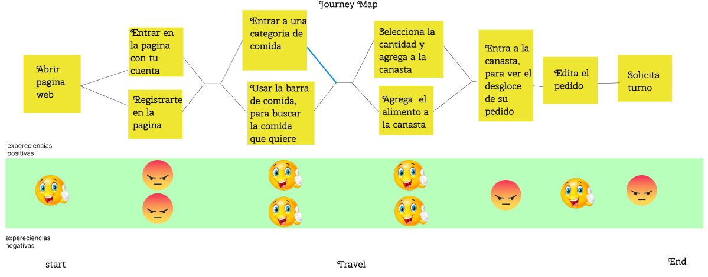
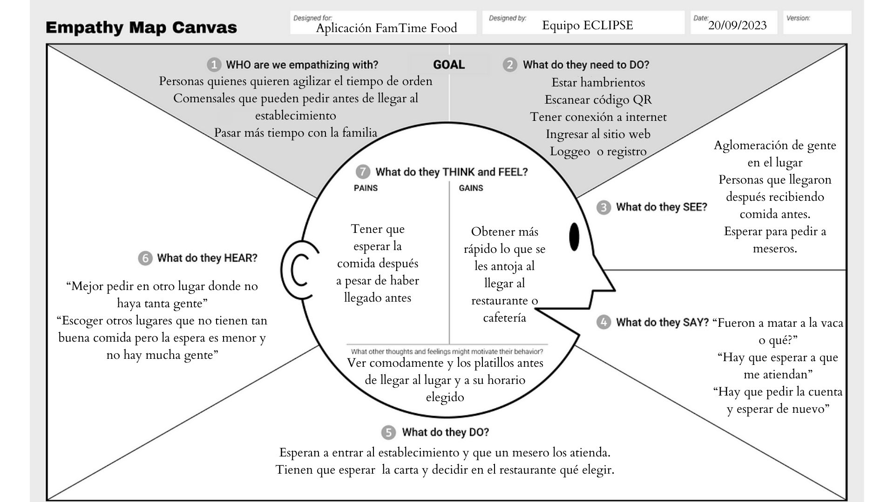

<h1 align="center"> Famtime food </h1>
<section align="justify">
  <h2 align="left">Acerca del proyecto</h2>
  
  Este es una idea de proyecto donde se busca optimizar el tiempo de respuesta del restaurante o cafetería, donde los clientes al llegar al restaurante o cafeteria, ya tengan su orden lista, evitando las perdidas de tiempo en espera de menu, meseros, etc.
  
  
  Esta aplicación está principalmente orientada hacia dispositivos móviles, puesto que se espera que la forma más fácil de implementación en el día a día de las personas sea por medio de una app web, aunque la app también contará con uma versión para escritorios.
  </apan>
</section>
<section align="justify">
  <h2 align="left">Documentación</h2>
  

    <h3 align="left">Aspectos técnicos del proyecto </h3>
    <!-- Laitex --->
    <a href="./Docs/Cafeteria-Menu/Doc-cafeteria.pdf" style="margin-right: 20px;">Cafeteria-Menu PDF file</a>
    
      En este link podrás encontrar el documento en .pdf, donde se habla de aspectos como:
      <ul>
        <li>Nombre del proyecto</li>
        <li>Descripción detallada del proyecto</li>
        <li>Requerimientos funcionales</li>
        <li>Requerimientos no funcionales</li>
        <li>Arquitectura</li>
        <li>Diagramas</li>
          <ul>
            <li>Diagrama de Casos de Uso</li>
            <li>Diagrama de Componentes</li>
            <li>Diagrama de Bases de Datos Entidad Relación</li>
            <li>Diagrama de Clases</li>
            <li>Diagramas de Secuencia</li>
            <li>Diagramas de Flujo</li>
            <li>Diagrama de Estados</li>
          </ul>
        <li>Propuesta de pantallas de mapa de sitio</li>
        <li>Manual de identidad</li>
          <ul>
            <li>Nombre de la marca</li>
            <li>Logo de la marca</li>
            <li>Icono de la app</li>
            <li>Paleta de colores de la app</li>
            <li>Tipografia de la app</li>
          </ul>
        <li>Prototipo de figma</li>
          <ul>
            <li>
              <a href="https://www.figma.com/file/jMDGvyJhrWegndvcyKfglJ/App-Cafeteria?type=design&node-id=0-1&mode=design&t=ZV4dCkDkixOnfDur-0">Esqueleto de la app</a>
            </li>
            <li>
              <a href="https://www.figma.com/proto/jMDGvyJhrWegndvcyKfglJ/App-Cafeteria?type=design&node-id=11-2&t=pBPoqDubd0GGsh8d-0&scaling=min-zoom&page-id=0%3A1&starting-point-node-id=11%3A2&show-proto-sidebar=1">Prototipo funcional</a>
            </li>
          </ul>
      </ul>
    
  

</section>
<section align="justify">
  <h2>Mapas</h2>
  
    En este apartado se muestran los links y/o imagenes de los mapas que se usaron, para el desarrollo de la aplicación.
  
  <!--Buyer person-->
    

    <h3>Journey Map</h3>
    

      
    

  

  

    <h3>Buyer Person</h3>
    <a href="https://www.canva.com/design/DAFwUaCOcZE/50RjQNNABKBntjp3pM4HfQ/edit">
    Ideal Buyer Person
    </a>
    
      En la siguiente tabla se muestra los buyer person de las personas de distintas clases sociales, con motivo de una mejor claridad del tipo de mercado donde la app estará destinada.
    
    <table>
      <tr>
        <td>Más</td>
        <td>buyer</td>
        <td>person</td>
      </tr>
      <tr>
        <td>
          <a href="#" style="margin-right: 20px;">Upper class</a>
        </td>
        <td>
          <a href="https://www.canva.com/design/DAFyvlS70oU/487SXZ8ttdGmKcXz8dISMg/edit?utm_content=DAFyvlS70oU&utm_campaign=designshare&utm_medium=link2&utm_source=sharebutton BuyenPerson-ClaseMedia" style="margin-right: 20px;">Middle class</a>
        </td>
        <td>
          <a href="https://www.canva.com/design/DAFytntySOs/L-TbFiqgHwwyAuBrCljjag/edit?utm_content=DAFytntySOs&utm_campaign=designshare&utm_medium=link2&utm_source=sharebutton" style="margin-right: 20px;">Low class</a>
        </td>
      </tr>
    </table>
  

  

    <h3>Empathy Map</h3>
    
      En esta imagen se muestra el Emphaty map del cliente ideal
    
    

      
    

    </a>
    
      En la siguiente tabla se muestra los buyer person de las personas de distintas clases sociales, con motivo de una mejor claridad del tipo de mercado donde la app estará destinada.
    
    <table>
      <tr>
        <td>Más</td>
        <td>empathy</td>
        <td>maps</td>
      </tr>
      <tr>
        <td>
          <a href="#" style="margin-right: 20px;">Upper class</a>
        </td>
        <td>
          <a href="https://www.canva.com/design/DAFyvUNcick/rLBg1cqFvgStSqxykDrRSw/edit?utm_content=DAFyvUNcick&utm_campaign=designshare&utm_medium=link2&utm_source=sharebutton emphaty map clase media" style="margin-right: 20px;">Middle class</a>
        </td>
        <td>
          <a href="https://www.canva.com/design/DAFyvvgx0J0/ENwfpBf21cZiPGAKkheYLQ/edit?utm_content=DAFyvvgx0J0&utm_campaign=designshare&utm_medium=link2&utm_source=sharebutton" style="margin-right: 20px;">Low class</a>
        </td>
      </tr>
    </table>
  

</section>
<section>
  <h2>Art</h2>
  
      <a href="https://drive.google.com/drive/folders/1AuNMp59X0YJqxR1alR2jJUgEV7NNbN8a?usp=sharing">Cover de la app con sus versiones.</a>
       
      En este link se muestra el cover de la aplicación, que aunque fue pedido, se piensa en implementar como pantalla de carga
       
      <a href="./Assets/Img/Art">Carpeta con el resto del arte</a>
       
      
        En este link se muetsra la ruta para que se pueda ver el resto del arte de la aplicación
      
  
</section>
<section align="justify">
  <h2>Integrantes de equipo</h2>
  
    En esta sección se especifican a los integrantes del equipo, puesto que dependiendo de la materia hay participaciones de cada uno de los miembros, provocando que se refleje en la participación total hacia el proyecto.
  
  <ul>
    <li>Desarrollo de App, Compocisión y Sistemas Operativos</li>
    <ul>
      <li>Víctor Chavarría</li>
      <li>Samuel Gutierrez</li>
      <li>Jonathan Zavala</li>
      <li>Grecia Morales</li>
    </ul>
    <li>Lenguajes Interpretados</li>
    <ul>
      <li>Víctor Chavarría</li>
      <li>Samuel Gutierrez</li>
      <li>Jonathan Zavala</li>
    </ul>
  </ul>
</section>
<section align="justify">
  <h2>Aportaciones</h2>
  
    En esta sección se especifica el trabajo que cada uno de los miembros ha hecho en el proyecto, para su culminación.
  
  <ul>
    <li>Víctor Chavarría</li>
    <ul>
      <li>Creo el repositorio.</li>
      <li>Flujo ideal y alterno.</li>
      <li>Boceto de UI.</li>
      <li>Requerimientos funcionales y no funcionales</li>
      <li>Diagrama de componentes.</li>
      <li>Diagrama de clases.</li>
      <li>Diagramas de secuencia.</li>
      <li>Diagrama de flujo de UI y SignIn.</li>
      <li>Diagrama de estado.</li>
      <li>Cover de la app.</li>
      <li>Buyer person del cliente ideal.</li>
      <li>Documentación en Latex.</li>
      <li>Empathy Map de la clase alta.</li>
      <li>Buyer person de la clase alta.</li>
      <li>README updates.</li>
      <li>Prototipo funcional.</li>
      <li>App icon.</li>
    </ul>
    <li>Samuel Gutierrez</li>
    <ul>
      <li>Requerimientos funcionales y no funcionales</li>
      <li>Diagrama de flujo de LogIn y Basket</li>
      <li>Cover de la app.</li>
      <li>Journey map.</li>
      <li>Empathy map de la clase baja.</li>
      <li>Buyer person de la clase baja.</li>
      <li>Prototipo funcional.</li>
      <li>Base de datos al código.</li>
    </ul>
    <li>Jonathan Zavala</li>
    <ul>
      <li>Requerimientos funcionales y no funcionales</li> 
      <li>Cover de la app.</li>
      <li>Journey map.</li>
      <li>Empathy map de la clase media.</li>
      <li>Buyer person de la clase alta.</li>
      <li>Prototipo funcional.</li>
      <li>Categorias de comida - front-end.</li>
    </ul>
    <li>Grecia Morales</li>
    <ul>
      <li>Diagrama de estado.</li>
      <li>Requerimientos funcionales y no funcionales</li>
      <li>Empathy map del cliente ideal.</li>
      <li>Prototipo funcional.</li>
      <li>Lorem ipsum</li>
    </ul>
  </ul>
</section>
<section align="justify">
  <h2>Notas</h2>
  
    Los colaboradores extra que pueden aparecer en el repositorio, no forman parte del equipo, sino que se trata de cuentas que no cerraron cesión de GitHub y que por falta de tiempo y/o no fijarse se terminaron subiendo ciertos cambios menores con dichas cuentas.
  
</section>